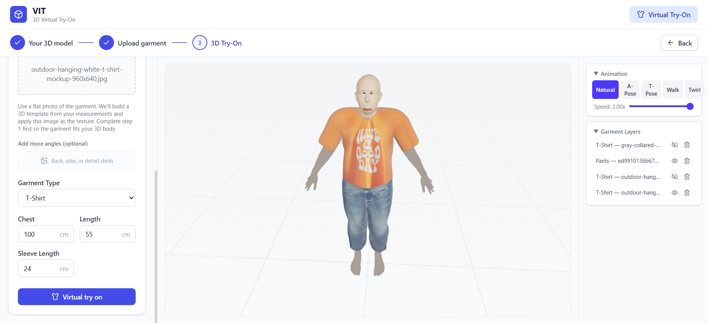

<p align="center">
  
</p>

<h1 align="center">VIT — 3D Virtual Interactive Try-On</h1>

<p align="center">
  <strong>Generate 3D human bodies from measurements, convert 2D garment photos into textured 3D meshes, and try them on in an interactive 3D viewer — all in the browser.</strong>
</p>

<p align="center">
  
  
  
  
  
  
  
</p>

---

## Table of Contents

- [Overview](#overview)
- [Demo](#demo)
- [Features](#features)
- [Architecture](#architecture)
- [Tech Stack](#tech-stack)
- [Workflow](#workflow)
- [Project Structure](#project-structure)
- [Getting Started](#getting-started)
- [API Reference](#api-reference)
- [ISP Integration](#isp-integration)
- [Configuration](#configuration)
- [Changelog](#changelog)
- [License](#license)

---

## Overview

**VIT** (Virtual Interactive Try-on) is a full-stack web application for 3D virtual fashion try-on. Users enter body measurements to generate a rigged 3D human model (powered by the **SMPL** body model), upload flat-lay garment photos that are automatically converted into textured 3D meshes, and view the fitted result in a real-time interactive 3D viewer with walk, twirl, A-pose, and natural-stand animations.

The garment generation pipeline uses **ISP** (Implicit Sewing Patterns — Li et al., NeurIPS 2023) neural networks to reconstruct 3D garments from learned codebooks, then conforms, textures, and skins them to the body for synchronized animation.

---

## Demo

<p align="center">
  
</p>

> **3-step wizard:** (1) Enter body measurements → generate 3D body, (2) Upload a garment photo (+ optional back/detail shots) → generate textured 3D garment, (3) Inspect the fitted result in the interactive 3D viewer with animations, speed control, and multi-layer management.

---

## Features

| Feature | Description |
|---------|-------------|
| **3D Body Generation** | Generate a parametric SMPL body (6,890 vertices, 24 joints) from height, chest, waist, hip, shoulder width, arm length, and inseam measurements |
| **SMPL Clay Mannequin Look** | Neutral gray matte body with procedural face texture (eyes, eyebrows, nose, lips) matching the classic SMPL reference style |
| **Face Texture** | Cylindrical UV mapping on the head region with calibrated eye, brow, nose, and lip positions; facial features remain on face, not body |
| **2D → 3D Garment Conversion** | Upload a flat-lay garment photo — background is automatically removed, silhouette analyzed, and a textured 3D mesh is generated |
| **Back Image Support** | Upload an optional back-view (or detail) photo; front and back images are composited into a dual-half texture atlas so both sides of the garment show correctly |
| **Neural Garment Reconstruction** | ISP neural networks reconstruct T-shirts, pants, and skirts from learned implicit sewing patterns |
| **Long-Sleeve Extension** | Button-down shirts, hoodies, and jackets automatically have their ISP-generated sleeves extended to the target length (up to 62 cm) |
| **Front/Back UV Split** | When a back image is provided, all upper-body garments use a dual-half atlas (left = front, right = back) with Z-median face classification — no more cylindrical projection artefacts |
| **Expanded Garment Types** | T-Shirt, Polo, **Button-Down Shirt**, **Hoodie**, **Jacket**, Pants, Dress |
| **Body-Conforming Fit** | Garments are automatically scaled, conformed, and anti-penetration pushed to fit the body mesh with realistic clearance |
| **Skeletal Animation** | Five animations — **Natural Stand**, **A Pose**, **T Pose**, **Walk** (~1.2 s cycle), **Twirl** (~2.0 s, 360°) — with a 24-joint SMPL skeleton; garments animate in sync |
| **Animation Speed Control** | Playback speed slider from 0.25× to 2.0× |
| **Multi-Garment Layering** | Add multiple garments (shirt + pants) with independent visibility toggles and per-layer deletion |
| **3-Point Studio Lighting** | Soft studio light rig (key 2.0, fill 0.65, rim 0.30 + HDRI wrap) calibrated to reveal SMPL body contours without harsh shadows |
| **Interactive 3D Viewer** | Rotate, pan, zoom with OrbitControls; stencil-buffer occlusion hides the body under garments |
| **Screenshot Capture** | Export the current viewport as a PNG image |
| **Responsive UI** | Tailwind CSS responsive layout with a step-by-step wizard interface |

---

## Architecture

```
┌─────────────────────────────────────────────────────────────┐
│                        BROWSER                              │
│  ┌──────────┐  ┌───────────────┐  ┌────────────────────┐   │
│  │ Measure- │  │  Garment      │  │  3D Viewer (R3F)   │   │
│  │ ment Form│→ │  Upload       │→ │  Body + Garments   │   │
│  │ (Step 1) │  │ (Step 2)      │  │  + Animations      │   │
│  │          │  │ + Back image  │  │  (Step 3)          │   │
│  └──────────┘  └───────────────┘  └────────────────────┘   │
│       │              │              ↑                        │
│       │    React + Zustand + Three.js (R3F)                 │
└───────┼──────────────┼──────────────┼───────────────────────┘
        │ POST         │ POST         │ GLB binary
        ▼              ▼              │
┌───────┼──────────────┼──────────────┼───────────────────────┐
│       │         FastAPI Server      │                        │
│  ┌────▼─────┐  ┌─────▼──────┐  ┌───┴──────────────┐        │
│  │  Body    │  │  Garment   │  │  Skinned GLB     │        │
│  │Generator │  │ Processor  │  │  Builder         │        │
│  │  (SMPL)  │  │(ISP+rembg) │  │(skeleton+anim)   │        │
│  └──────────┘  └────────────┘  └──────────────────┘        │
│       │              │                                       │
│  ┌────▼──────────────▼──────────────────────────────┐       │
│  │         ISP Neural Networks (PyTorch)             │       │
│  │   SDF · Atlas · Drape · SMPL Diffusion            │       │
│  └───────────────────────────────────────────────────┘       │
└──────────────────────────────────────────────────────────────┘
```

---

## Tech Stack

### Frontend

| Technology | Role |
|------------|------|
| **React 19** + **TypeScript 5.9** | UI framework |
| **Vite 7** | Build tool & dev server |
| **Three.js r182** via **React Three Fiber** | 3D rendering engine |
| **@react-three/drei** | 3D helpers (OrbitControls, GLB loader, Environment, useTexture) |
| **Zustand** | Lightweight state management (body, garment, animation stores) |
| **Tailwind CSS 4** | Utility-first styling |
| **Lucide React** | Icon library |
| **React Router 7** | Client-side routing |
| **React Dropzone** | Drag-and-drop file upload |

### Backend

| Technology | Role |
|------------|------|
| **Python 3.10+** | Runtime |
| **FastAPI** | Async REST API framework |
| **Uvicorn** | ASGI server |
| **Trimesh** | 3D mesh processing (creation, repair, smoothing, boolean ops) |
| **NumPy** / **SciPy** | Numerical computation, spatial queries (cKDTree) |
| **Pillow** | Image processing |
| **rembg** (u2net) | AI background removal from garment photos |
| **pygltflib** | glTF 2.0 / GLB binary construction |
| **Pydantic** | Request/response validation |

### AI / ML

| Technology | Role |
|------------|------|
| **SMPL** (Skinned Multi-Person Linear Model) | Parametric 3D human body model (6,890 verts, 24 joints) |
| **ISP** (Implicit Sewing Patterns, NeurIPS 2023) | Neural 3D garment reconstruction from learned codebooks |
| **PyTorch** ≥ 2.0 | Deep learning framework for ISP inference |
| **u2net** (via rembg) | Salient object detection for background removal |

---

## Workflow

### Step 1 — Generate 3D Body

1. User selects **gender** and enters body measurements (height, chest, waist, hip, shoulder width, arm length, inseam) in centimeters.
2. The server loads the **SMPL** body model, generates a T-pose mesh scaled to the user's proportions, and computes body landmarks (shoulder line, waist line, hip width, etc.).
3. A neutral gray matte material is applied (matching the classic SMPL clay-mannequin reference). The head region gets **cylindrical UV mapping** and a procedural **face texture** with eyes, eyebrows, nose, and lips drawn at calibrated positions.
4. A **skinned GLB** is built with a 24-joint skeleton, inverse bind matrices, per-vertex skin weights, and five animations: **natural_stand**, **a_pose**, **t_pose**, **walk**, and **twirl**.
5. The GLB binary is returned to the browser and displayed in the 3D viewer.

### Step 2 — Upload & Process Garment

1. User uploads a **flat-lay garment photo** (JPEG/PNG/WebP), optionally adds **back or detail photos** via "Add more angles", selects the garment type, and enters measurements.
2. The server removes the background using **rembg/u2net** and analyzes the garment silhouette.
3. The **ISP neural network** generates a 3D garment mesh from learned implicit sewing patterns.
4. The garment is **conformed** to the body:
   - Uniform XZ scaling to match the widest body cross-section + clearance
   - Top-anchored Y stretch for desired garment length
   - Sleeve trimming (short garments) or **sleeve extension** (long-sleeve button-down / hoodie / jacket) to match desired sleeve length
   - Armpit boundary sealing
   - Laplacian smoothing for a clean surface
   - Multi-pass anti-penetration push to prevent body clipping
5. Texture is applied:
   - **Without back image** → cylindrical UV wrapping (full garment color fills the tube)
   - **With back image** → **dual-half texture atlas** (front image on left half, back image on right half) with Z-median face classification: front-facing faces sample the left half, back-facing faces sample the right half
6. Garment vertices are mapped to nearest body vertices for **skinning weights transfer**.
7. A skinned GLB with matching animations is returned.

### Step 3 — Interactive 3D Try-On

1. Body and garment GLBs are rendered together in a **React Three Fiber** scene.
2. **Stencil buffer** occlusion hides the body mesh behind garment meshes for realistic appearance.
3. **3-point studio lighting** (key 2.0 + fill 0.65 + rim 0.30 + HDRI 0.30 wrap) reveals body contours without harsh shadows.
4. User can:
   - **Rotate / Pan / Zoom** the camera (OrbitControls)
   - Toggle between **Natural Stand**, **A Pose**, **T Pose**, **Walk**, and **Twirl** animations
   - Adjust **animation speed** (0.25× – 2.0×)
   - **Add more garments** (multi-layer support)
   - **Toggle visibility** of individual garment layers
   - **Delete** garments from the scene
   - **Capture screenshots** as PNG

---

## Project Structure

```
VIT/
├── client/                          # React frontend
│   ├── package.json
│   ├── vite.config.ts
│   ├── tsconfig.json
│   └── src/
│       ├── App.tsx                  # Router setup
│       ├── main.tsx                 # Entry point
│       ├── index.css                # Global styles (Tailwind)
│       ├── api/                     # API client functions
│       │   ├── body.ts              # POST /api/body/generate
│       │   ├── garment.ts           # POST /api/garment/process
│       │   └── tryon.ts             # POST /api/tryon/create
│       ├── components/
│       │   ├── forms/
│       │   │   ├── MeasurementForm.tsx  # Body measurement input
│       │   │   └── GarmentUpload.tsx    # Garment upload + back image
│       │   ├── viewer/
│       │   │   ├── ModelViewer.tsx       # R3F canvas wrapper
│       │   │   ├── TryOnScene.tsx       # Body + garment scene
│       │   │   ├── BodyModel.tsx        # GLB body loader + animation
│       │   │   ├── GarmentModel.tsx     # GLB garment loader + animation
│       │   │   ├── Lighting.tsx         # 3-point studio light rig
│       │   │   ├── Stage.tsx            # Grid + shadow plane
│       │   │   └── ViewerControls.tsx   # Animation, speed & layer controls
│       │   ├── layout/              # Header, layout wrappers
│       │   └── ui/                  # Reusable UI components
│       ├── hooks/
│       │   ├── useBodyModel.ts      # Body generation hook
│       │   └── useGarmentModel.ts   # Garment processing hook
│       ├── pages/
│       │   ├── HomePage.tsx         # Landing page
│       │   └── TryOnPage.tsx        # 3-step try-on wizard
│       ├── store/                   # Zustand state stores
│       │   ├── bodyStore.ts         # Body mesh, landmarks, loading state
│       │   ├── garmentStore.ts      # Garments array, visibility toggles
│       │   └── animationStore.ts    # Active animation, playback speed
│       ├── types/                   # TypeScript type definitions
│       └── utils/                   # Utility functions
│
├── server/                          # Python backend
│   ├── requirements.txt
│   └── app/
│       ├── main.py                  # FastAPI app + CORS + router
│       ├── config.py                # Environment configuration
│       ├── api/                     # Route handlers
│       │   ├── router.py            # API router registration
│       │   ├── body.py              # POST /api/body/generate
│       │   ├── garment.py           # POST /api/garment/process
│       │   ├── tryon.py             # POST /api/tryon/create
│       │   └── isp.py               # ISP status, generate, drape
│       ├── models/                  # Pydantic request/response models
│       ├── services/                # Business logic
│       │   ├── body_generator.py    # Parametric body mesh construction
│       │   ├── smpl_body.py         # SMPL model (24 joints, 6890 verts)
│       │   │                        #   → neutral gray color, face texture,
│       │   │                        #     cylindrical head UVs
│       │   ├── garment_processor.py # Full garment pipeline (ISP + conform)
│       │   │                        #   → sleeve extension, front/back UV split
│       │   ├── isp_service.py       # ISP neural network integration
│       │   ├── skinned_glb_builder.py # GLB with skeleton + 5 animations
│       │   │                        #   → body cylindrical UVs, face texture PNG
│       │   ├── texture_extractor.py # Background removal + dual-half atlas
│       │   ├── silhouette_analyzer.py # Garment shape analysis
│       │   ├── pbr_maps.py          # Normal / roughness map generation
│       │   └── fabric_diffusion.py  # Fabric texture diffusion helpers
│       ├── assets/                  # SMPL model files
│       └── utils/                   # Helper functions
│           └── mesh_helpers.py      # UV assignment (cylindrical, pants,
│                                    #   front-projection, split)
│
├── ISP/                             # ISP neural networks (submodule)
│   ├── checkpoints/                 # Pre-trained model weights (~20 files)
│   ├── networks/                    # Neural network definitions
│   ├── smpl_pytorch/                # SMPL PyTorch implementation
│   └── utils/                       # ISP utilities
│
├── scripts/                         # Utility scripts
│   └── gen_wrinkle_bump.py          # Generates wrinkle bump texture
│
├── Dashboard.png                    # App screenshot (used in README)
└── README.md
```

---

## Getting Started

### Prerequisites

| Requirement | Version |
|-------------|---------|
| **Node.js** | 18+ |
| **Python** | 3.10+ |
| **Git** | 2.30+ |
| **PyTorch** | 2.0+ (optional, for ISP neural garments) |

### 1. Clone the Repository

```bash
git clone https://github.com/tahahasan01/3D_VIT.git
cd 3D_VIT
```

### 2. Backend Setup

```bash
cd server
python -m venv venv

# Activate virtual environment
venv\Scripts\activate          # Windows
source venv/bin/activate       # macOS / Linux

pip install -r requirements.txt
```

### 3. ISP Setup (Optional — for neural garment generation)

```bash
cd ISP
pip install -r requirements.txt
```

Download the pre-trained checkpoints and place them in `ISP/checkpoints/`. See [ISP/SETUP_VIT.md](ISP/SETUP_VIT.md) for detailed instructions.

### 4. Frontend Setup

```bash
cd client
npm install
```

### 5. Run the Application

**Start the backend** (from `server/` directory):

```bash
cd server
python -m uvicorn app.main:app --host 0.0.0.0 --port 8000
```

**Start the frontend** (from `client/` directory):

```bash
cd client
npm run dev
```

Open **http://localhost:5173** in your browser. The API runs on **http://localhost:8000**.

---

## API Reference

### Health Check

```
GET /health
→ { "status": "healthy", "version": "0.1.0" }
```

### Body Generation

```
POST /api/body/generate
Content-Type: application/json

{
  "gender": "male",
  "height": 175,
  "chest": 100,
  "waist": 85,
  "hip": 95,
  "shoulder_width": 45,
  "arm_length": 60,
  "inseam": 80,
  "use_smpl": true
}

→ Binary GLB (application/octet-stream)
  Headers: X-Body-Landmarks (JSON), X-Body-Model-Type (smpl|parametric)
```

### Garment Processing

```
POST /api/garment/process
Content-Type: multipart/form-data

Fields:
  image: <garment-photo.jpg>
  additional_images[]: <back-view.jpg>   (optional)
  measurements: {
    "garment_type": "button_down",
    "chest": 100,
    "length": 76,
    "sleeve_length": 62
  }
  body_landmarks: <JSON from body generation>

→ Binary GLB (application/octet-stream)
  Headers: X-Garment-Fit (conforming|parametric)
```

### Try-On (Combined)

```
POST /api/tryon/create
Content-Type: multipart/form-data

Fields:
  garment_image: <garment-photo.jpg>
  additional_images[]: <back-view.jpg>   (optional)
  body_measurements: <JSON>
  garment_measurements: <JSON>

→ {
    "body_glb_base64": "...",
    "garment_glb_base64": "...",
    "body_landmarks": {...},
    "garment_fit": "isp|parametric",
    "body_model_type": "smpl|parametric"
  }
```

### ISP Endpoints

```
GET  /api/isp/status     → ISP readiness, checkpoint availability, CUDA status
POST /api/isp/generate   → Generate T-pose garment mesh (type, idx, resolution)
POST /api/isp/drape      → Generate + drape garment on posed body
```

Full interactive API documentation available at **http://localhost:8000/docs** (Swagger UI).

---

## ISP Integration

This project integrates **Implicit Sewing Patterns** (Li et al., NeurIPS 2023) for neural 3D garment reconstruction.

### Supported Garment Types

| Type | Checkpoints Required |
|------|---------------------|
| **T-Shirt** | `shirt_sdf_f.pth`, `shirt_sdf_b.pth`, `shirt_rep.pth`, `shirt_atlas_f.pth`, `shirt_atlas_b.pth`, `drape_shirt.pth` |
| **Pants** | `pants_sdf_f.pth`, `pants_sdf_b.pth`, `pants_rep.pth`, `pants_atlas_f.pth`, `pants_atlas_b.pth`, `drape_pants.pth` |
| **Skirt** | `skirt_sdf_f.pth`, `skirt_sdf_b.pth`, `skirt_rep.pth`, `skirt_atlas_f.pth`, `skirt_atlas_b.pth`, `drape_skirt.pth` |

> Button-Down, Polo, Hoodie, and Jacket all use the T-shirt ISP checkpoint with sleeve extension applied afterward.

### How It Works

1. **SDF Networks** reconstruct front and back garment pattern panels as signed distance fields
2. **Atlas Networks** map 2D UV coordinates onto the 3D panels
3. **Sewing** stitches front/back panels together at seams (body sides, armholes)
4. **Drape Networks** apply pose-dependent deformation for realistic cloth behavior
5. **SMPL Diffusion** generates plausible body poses for draping

The ISP service runs on **CPU** when CUDA is unavailable (automatic fallback).

---

## Configuration

Environment variables can be set in a `.env` file in the `server/` directory:

| Variable | Default | Description |
|----------|---------|-------------|
| `CORS_ORIGINS` | `["http://localhost:5173"]` | Allowed CORS origins |
| `UPLOAD_DIR` | `uploads/` | Directory for uploaded images |
| `OUTPUT_DIR` | `output/` | Directory for generated files |

---

## Changelog

### Latest Changes

#### Body Model
- Changed body color to neutral gray `(200, 200, 200)` matching the classic SMPL clay-mannequin reference
- Added **procedural face texture** with calibrated eye, eyebrow, nose, and lip positions using cylindrical UV mapping on the head region
- Added **cylindrical UV coordinates** (`TEXCOORD_0`) to the body primitive in the exported GLB for future texture map support
- Fixed color pipeline mismatch: body and face now use the same sRGB `baseColorFactor` for a uniform skin tone

#### Lighting & Viewer
- Redesigned 3-point studio lighting to match the SMPL reference style: key `2.0`, fill `0.65`, rim `0.30`, HDRI wrap `0.30`, ambient `0.25`
- Body material roughness set to `0.65` (matte clay look); face material `0.55`
- Added **5 animations**: Natural Stand, A Pose, T Pose, Walk, Twirl (previously only Walk and Twirl)

#### Garment Pipeline
- Added support for **Button-Down Shirt**, **Polo**, **Hoodie**, and **Jacket** garment types
- **Sleeve extension**: ISP-generated tee mesh sleeves are automatically scaled outward to match the target length for long-sleeve garments (>28 cm)
- **Front/back dual-half texture atlas**: when a back image is uploaded, both upper-body and pants garments use a split UV atlas (front image left half U 0–0.5, back image right half U 0.5–1.0) with Z-median face classification
- Fixed seam vertex map extension for upper-body garments using split UV to prevent skinning artefacts

---

## Acknowledgments

- **SMPL** — Loper et al., "SMPL: A Skinned Multi-Person Linear Model", SIGGRAPH Asia 2015
- **ISP** — Li et al., "ISP: Multi-Layered Garment Draping with Implicit Sewing Patterns", NeurIPS 2023
- **rembg** — Background removal powered by u2net
- **React Three Fiber** — React renderer for Three.js

---

## License

This project is for educational and research purposes. The SMPL body model and ISP networks are subject to their respective licenses.
